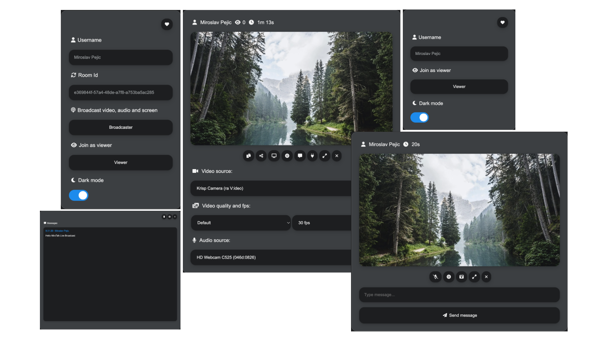

<h1 align="center">MiroTalk WebRTC Live Broadcast</h1>

<br />

<div align="center">

<a href="">[](https://www.linkedin.com/in/miroslav-pejic-976a07101/)</a>
<a href=""></a>
<a href="">[](https://discord.gg/rgGYfeYW3N)</a>

</div>

<p align="center">MiroTalk BRO Live Broadcast allows to broadcast live video, audio and screen stream to all connected users (viewers) and receive messages from them. Can handle unlimited rooms, without time limitations, each having a broadcast and many viewers.</a></p>

---

<p align="center">
    <a href="https://bro.mirotalk.com">Explore MiroTalk BRO</a>
</p>

---

<p align="center">
    <a href="https://bro.mirotalk.com"></a>
</p>

---

<p align="center">
    Join our community for questions, discussions, and support on <a href="https://discord.gg/rgGYfeYW3N">Discord</a>
</p>

---

</details>

<details open>
<summary>Quick Start</summary>

<br/>

Start the app using [nodejs](https://nodejs.org/en/download):

```bash
# Copy .env.template in .env and edit it if needed
$ cp .env.template .env
# Install dependencies
$ npm install
# Run the app
$ npm start
```

Start the app using [docker](https://docs.docker.com/engine/install/) - [docker-compose](https://docs.docker.com/compose/) and optional [official image](https://hub.docker.com/r/mirotalk/bro):


```bash
# Copy .env.template in .env and edit it if needed
$ cp .env.template .env
# Copy docker-compose.template.yml in docker-compose.yml and edit it if needed
$ cp docker-compose.template.yml docker-compose.yml
# Get official image from Docker Hub
$ docker pull mirotalk/bro:latest
# Run the image in a container
$ docker-compose up #-d
```

Server up and running

```js
Server is running {
  home: 'http://localhost:3016',
  broadcast: 'http://localhost:3016/broadcast?id=123&name=Broadcaster',
  viewer: 'http://localhost:3016/viewer?id=123&name=Viewer',
  viewerHome: 'http://localhost:3016/home?id=123'
}
```

The app should now be running on your http://localhost:3016, you can choose if join room as a `Broadcaster` or `Viewer`.

The `Broadcaster` stream the audio, video or screen to all connected viewers and can receive messages from them.

The `Viewer` get the audio, video or screen that is streamed from the broadcaster and can send messages to it.

<details open>
<summary>Hetzner & Contabo</summary>

<br/>

[](https://hetzner.cloud/?ref=XdRifCzCK3bn)

This application is running for `demonstration purposes` on [Hetzner](https://www.hetzner.com/), one of `the best` [cloud providers](https://www.hetzner.com/cloud) and [dedicated root servers](https://www.hetzner.com/dedicated-rootserver).

---

Use [my personal link](https://hetzner.cloud/?ref=XdRifCzCK3bn) to receive `€⁠20 IN CLOUD CREDITS`.

---

[](https://www.dpbolvw.net/click-101027391-14462707)

Experience also top-tier German web hosting – dedicated servers, VPS, and web hosting at `unbeatable prices`. Reliable, secure, and backed by 24/7 support. [Explore now here](https://www.dpbolvw.net/click-101027391-14462707)

---

To set up your own instance of `MiroTalk BRO` on a dedicated cloud server, please refer to our comprehensive [self-hosting documentation](https://docs.mirotalk.com/mirotalk-bro/self-hosting/). This guide will walk you through the process step by step, ensuring a smooth and successful deployment.

</details>

</details>

<details>
<summary>Direct Join</summary>

<br>

You can direct join room as `broadcaster` or `viewer` specifying the room id and your name.

| As            | URL                                                     |
| ------------- | ------------------------------------------------------- |
| `Broadcaster` | http://localhost:3016/broadcast?id=123&name=Broadcaster |
| `Viewer`      | http://localhost:3016/viewer?id=123&name=Viewer         |

| Params | Type   | Description |
| ------ | ------ | ----------- |
| id     | string | Room Id     |
| name   | string | User name   |

</details>

<details>
<summary>Embedding</summary>

<br/>

Embedding MiroTalk Live Broadcast into a service or app using an iframe.

```html
<iframe
    allow="camera; microphone; display-capture; fullscreen; clipboard-read; clipboard-write; web-share; autoplay"
    src="https://bro.mirotalk.com"
    style="height: 100vh; width: 100vw; border: 0px;"
></iframe>
```

</details>

<details>
<summary>Documentations</summary>

<br>

-   [Install your own Stun/Turn](./docs/coturn.md)
-   [Ngrok](./docs/ngrok.md)
-   [How to Self-hosting](./docs/self-hosting.md)
-   [Rest API](./app/api/README.md)

</details>

<details>
<summary>Credits</summary>

<br>

-   Gabriel Tanner [webrtc-broadcast-logic](https://gabrieltanner.org/blog/webrtc-video-broadcast/)

</details>

<details>
<summary>License</summary>

<br/>

[](LICENSE)

MiroTalk BRO is free and open-source under the terms of AGPLv3 (GNU Affero General Public License v3.0). Please `respect the license conditions`, In particular `modifications need to be free as well and made available to the public`. Get a quick overview of the license at [Choose an open source license](https://choosealicense.com/licenses/agpl-3.0/).

To obtain a [MiroTalk BRO license](https://docs.mirotalk.com/license/licensing-options/) with terms different from the AGPLv3, you can conveniently make your [purchase on CodeCanyon](https://codecanyon.net/item/mirotalk-bro-webrtc-p2p-live-broadcast/45887113). This allows you to tailor the licensing conditions to better suit your specific requirements.

</details>

<details open>
<summary>Support</summary>

<br/>

If MiroTalk BRO has been useful for you and want to contribute to its continued success, consider becoming a backer or sponsor by visiting [this link](https://github.com/sponsors/miroslavpejic85).

Your support means the world to us, and together, we can make MiroTalk Live Broadcast even better! Thank you for being part of this amazing journey. 🌟

</details>

---

## Diving into Additional MiroTalk Projects:

<details>
<summary>MiroTalk SFU</summary>

<br>

Try also [MiroTalk SFU](https://github.com/miroslavpejic85/mirotalksfu) `selective forwarding unit` real-time video conferences, optimized for large groups. `Unlimited time, unlimited concurrent rooms` each having 8+ participants, up to ~ 100 per single CPU.

</details>

<details>
<summary>MiroTalk P2P</summary>

<br/>

Try also [MiroTalk P2P](https://github.com/miroslavpejic85/mirotalk) `peer to peer` real-time video conferences, optimized for small groups. `Unlimited time, unlimited concurrent rooms` each having 5-8 participants.

</details>

<details>
<summary>MiroTalk C2C</summary>

<br>

Try also [MiroTalk C2C](https://github.com/miroslavpejic85/mirotalkc2c) `peer to peer` real-time video conferences, optimized for cam 2 cam. `Unlimited time, unlimited concurrent rooms` each having 2 participants.

</details>

<details>
<summary>MiroTalk WEB</summary>

<br>

Try also [MiroTalk WEB](https://github.com/miroslavpejic85/mirotalkwebrtc) a platform that allows for the management of an `unlimited number of users`. Each user must register with their email, username, and password, after which they gain access to their `personal dashboard`. Within the dashboard, users can `manage their rooms and schedule meetings` using the desired version of MiroTalk on a specified date and time. Invitations to these meetings can be sent via email, shared through the web browser, or sent via SMS.

</details>

---
