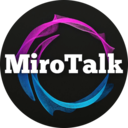
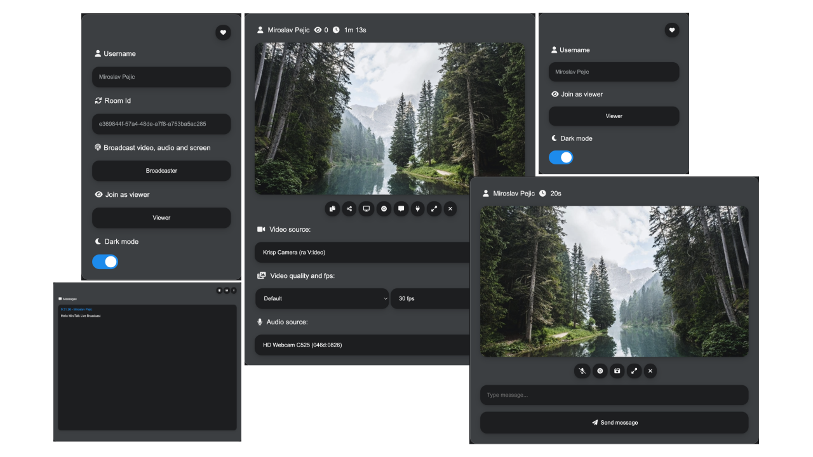

<div align="center">
    <a href="https://bro.mirotalk.com" target="_blank">
        
    </a>
</div>

<h1 align="center">MiroTalk BRO</h1>

<h3 align="center">WebRTC Live Broadcast enables real time video, audio, and screen streaming to all connected viewers</h3>

<br />

<div align="center">

[](https://github.com/miroslavpejic85/mirotalkbro/stargazers)
[](https://github.com/miroslavpejic85/mirotalkbro/network/members)

<a href="https://choosealicense.com/licenses/agpl-3.0/"></a>
<a href="https://hub.docker.com/r/mirotalk/bro"></a>
<a href="https://github.com/miroslavpejic85/mirotalkbro/commits/main"></a>
<a href="https://discord.gg/rgGYfeYW3N"></a>
<a href="https://www.linkedin.com/in/miroslav-pejic-976a07101/"></a>

</div>

<br />

<p align="center"><strong>MiroTalk BRO</strong> is a <strong>self-hosted, open-source</strong> platform for <strong>real-time live video, audio, and screen broadcasting</strong> to all connected viewers using <strong>WebRTC</strong>. Handles unlimited rooms with no time limits, each with one broadcaster and many viewers.</p>

<p align="center">
    <a href="https://bro.mirotalk.com">Try Live Demo</a> · <a href="https://docs.mirotalk.com/mirotalk-bro/self-hosting/">Documentation</a> · <a href="https://discord.gg/rgGYfeYW3N">Discord</a> · <a href="https://github.com/sponsors/miroslavpejic85">Sponsor</a>
</p>

<br />

<p align="center">
    <a href="https://bro.mirotalk.com">
        
    </a>
</p>

<hr />

<br />

<details open>
<summary>⚡ Quick start</summary>

<br/>


If `BROADCASTING=sfu`, ensure you have all the [requirements](https://mediasoup.org/documentation/v3/mediasoup/installation/#requirements) installed.

Requirements install example for `Ubuntu 24.04 LTS`

```bash
apt-get update
apt-get install -y build-essential
apt-get install -y python3 python3-pip
```

**Start in 5 commands:**

```bash
git clone https://github.com/miroslavpejic85/mirotalkbro.git
cd mirotalkbro
cp .env.template .env
npm install
npm start
```

Open [http://localhost:3016](http://localhost:3016) - done!

</details>

<details>
<summary>🐳 Docker</summary>

<br/>


**Prerequisites:** Install [Docker Engine](https://docs.docker.com/engine/install/) and [Docker Compose](https://docs.docker.com/compose/install/) - Image available on [Docker Hub](https://hub.docker.com/r/mirotalk/bro)

```bash
git clone https://github.com/miroslavpejic85/mirotalkbro.git
cd mirotalkbro
cp .env.template .env
cp docker-compose.template.yml docker-compose.yml
docker-compose pull    # optional: pull official image
docker-compose up      # add -d to run in background
```

Open [http://localhost:3016](http://localhost:3016) - done!

> **Note:**
> Edit `.env` and `docker-compose.yml` to customize your setup.

</details>

<details>
<summary>📚 Documentation</summary>

<br/>

For detailed guides and references, visit the **[official documentation](https://docs.mirotalk.com)**:

- [About](https://docs.mirotalk.com/mirotalk-bro/)
- [Self-Hosting Guide](https://docs.mirotalk.com/mirotalk-bro/self-hosting/)
- [Automation-scripts](https://docs.mirotalk.com/scripts/about/)
- [Configurations](https://docs.mirotalk.com/mirotalk-bro/configurations/)
- [Integration](https://docs.mirotalk.com/mirotalk-bro/integration/)
- [Direct Room Join](https://docs.mirotalk.com/mirotalk-bro/join-room/)
- [REST API Documentation](https://docs.mirotalk.com/mirotalk-bro/api/)
- [Ngrok](https://docs.mirotalk.com/mirotalk-bro/ngrok/)

</details>

<details open>
<summary>☁️ Recommended Hosting Providers</summary>

<br/>

| Provider                                                                                         | Description                                                                                                | Link                                                                |
| ------------------------------------------------------------------------------------------------ | ---------------------------------------------------------------------------------------------------------- | ------------------------------------------------------------------- |
| [](https://www.hetzner.com)                          | High-performance cloud servers and dedicated root servers with top-tier reliability. Powers our live demo. | [Get €20 Free Credits](https://hetzner.cloud/?ref=XdRifCzCK3bn)     |
| [](https://www.netcup.com/en/?ref=309627)              | Enterprise-grade performance at unbeatable prices. Scalable and reliable.                                  | [Explore Netcup](https://www.netcup.com/en/?ref=309627)             |
| [](https://hostinger.com/?REFERRALCODE=MIROTALK) | Fast, reliable hosting with 24/7 support and great performance.                                            | [Check out Hostinger](https://hostinger.com/?REFERRALCODE=MIROTALK) |
| [](https://www.dpbolvw.net/click-101027391-14462707) | Top-tier German hosting, dedicated servers, VPS, and web hosting at unbeatable prices.                     | [Explore Contabo](https://www.dpbolvw.net/click-101027391-14462707) |

To set up your own instance of `MiroTalk BRO` on a dedicated cloud server, please refer to our comprehensive [self-hosting documentation](https://docs.mirotalk.com/mirotalk-bro/self-hosting/).

</details>

<details>
<summary>🤝 Contributing</summary>

<br/>

Contributions are welcome and greatly appreciated! Whether it's bug fixes, features, or documentation - every contribution helps.

1. Fork the repository
2. Create your feature branch
3. Submit a pull request

Have questions? Join our [Discord community](https://discord.gg/rgGYfeYW3N)!

</details>

<details>
<summary>📄 License</summary>

<br/>

[](LICENSE)

MiroTalk BRO is free and open-source under the terms of AGPLv3 (GNU Affero General Public License v3.0). Please `respect the license conditions`, In particular `modifications need to be free as well and made available to the public`. Get a quick overview of the license at [Choose an open source license](https://choosealicense.com/licenses/agpl-3.0/).

To obtain a [MiroTalk BRO license](https://docs.mirotalk.com/license/licensing-options/) with terms different from the AGPLv3, you can conveniently make your [purchase on CodeCanyon](https://codecanyon.net/item/mirotalk-bro-webrtc-p2p-live-broadcast/45887113). This allows you to tailor the licensing conditions to better suit your specific requirements.

</details>

<details open>
<summary>❤️ Support the project</summary>

<br/>

Do you find MiroTalk BRO indispensable for your needs? Join us in supporting this transformative project by [becoming a backer or sponsor](https://github.com/sponsors/miroslavpejic85). By doing so, not only will your logo prominently feature here, but you'll also drive the growth and sustainability of MiroTalk BRO. Your support is vital in ensuring that this valuable platform continues to thrive and remain accessible for all. Make an impact – back MiroTalk BRO today and be part of this exciting journey!

</details>

<br />

---

🌐 **Explore all MiroTalk projects:**

**[ → MiroTalk Overview](https://docs.mirotalk.com/overview/)**


<p align="center">
  Built with ❤️ by <a href="https://www.linkedin.com/in/miroslav-pejic-976a07101/">Miroslav</a> and the open-source community
</p>
